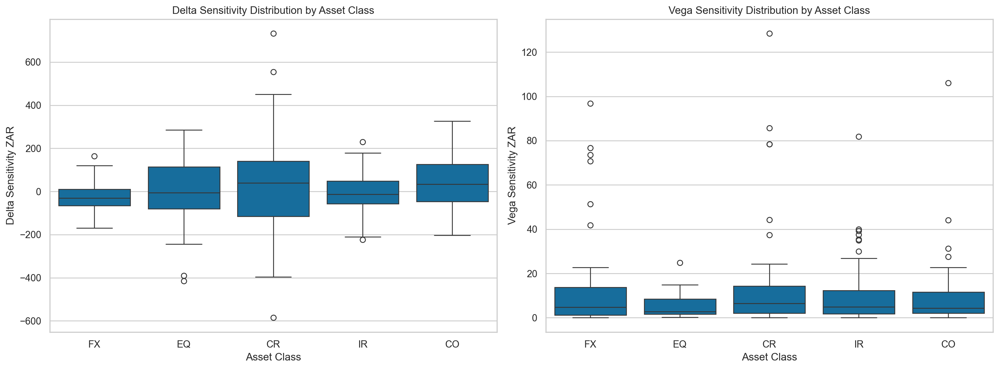
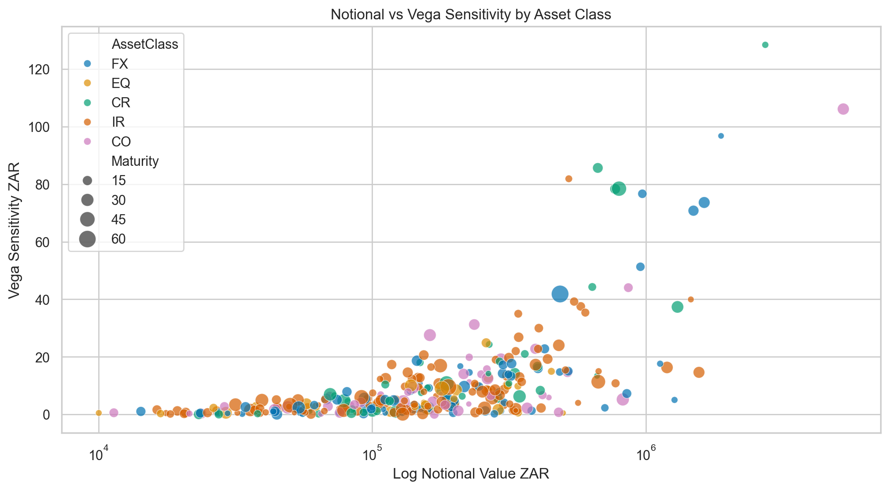
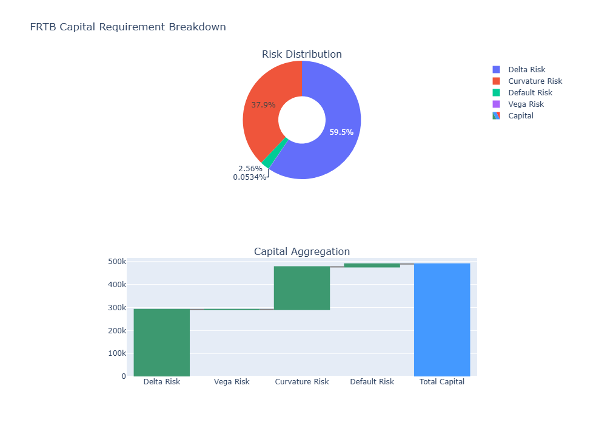

# SA-FRTB
- Author: Patrick Mthisi
- Contact details: patrickmthisi@hotmail.com

# Fundamental Review of the trading book (FRTB) based on the standardised approach
## Objective: 

The project aims to compute `regulatory capital requirements for market risk based on the standardised approach`. Under the Basel Committee on Banking Supervision (BCBS):

"The standardised approach must be calculated by all banks and reported to their supervisor every month."

The standardised approach capital requirement is the aggregation of three charges:
1. Sensitivity-based charges:
    - `Delta risk`: sensitivity to price movements.
    - `Vega risk`: sensitivity to volatility changes, only applicable to instruments with optionality.
    - `Curvature risk (CVR)`: captures the incremental risk not accounted for by the delta risk of price changes.
2. Default risk charge (DRC): captures jump-to-default risk (JTD).
3. Residual risk add-on (RRAO): captures any additional risk beyond the main risk factors already accounted for in the sensitivities-based method and the DRC.

In this project, we generated a hypothetical, yet realistic trading book comprising 500 trading positions for differentiated flavours of asset classes. BCBS asserts that a fundamental premise of the standardised approach for market risk is that a bank's pricing model employed in actual profit and loss reporting serves as a suitable foundation for establishing regulatory capital requirements for all market risks.  To that end, we assume that the generated trading sensitivities are computed based on prudent valuation practices:

We then developed a prototype FRTB engine based on the methodology, risk weights, buckets, and other parameters as stipulated by the BCBS. Our simulated trading book was then input into the engine to compute the total capital charge. The results are depicted below:

